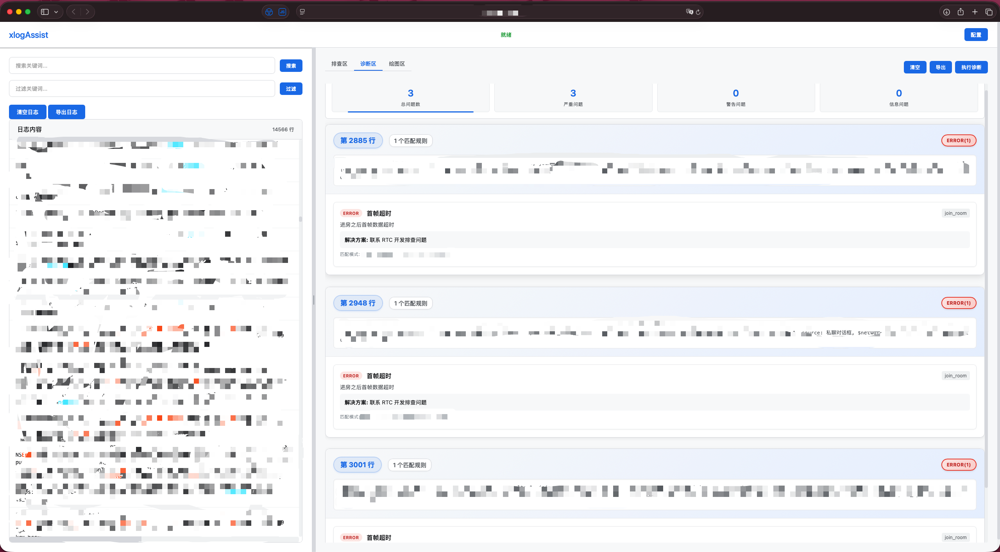
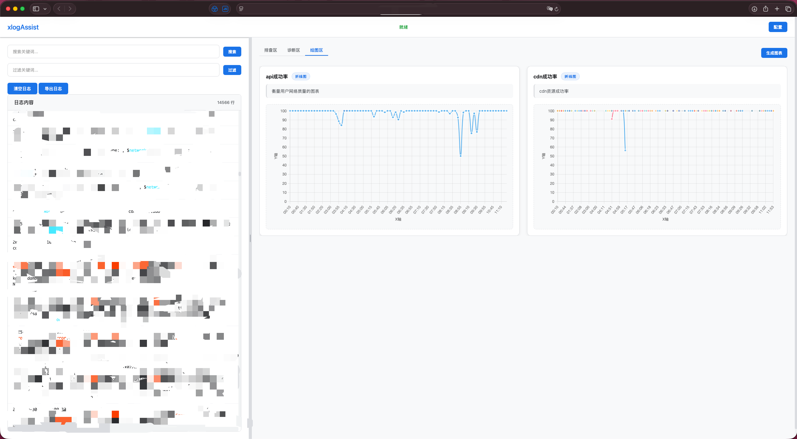

# xlogAssist - 日志分析工具

一个功能强大的前端日志分析工具，支持拖拽上传、正则匹配高亮、配置组管理、问题诊断、自定义下载和图表可视化等特性。

## 功能特性

### 文件处理
- 📁 **拖拽上传**: 支持拖拽日志文件上传，支持多文件批量处理
- 💾 **上次日志**: 自动保存上次日志，支持快速重新打开
- 📄 **格式支持**: 支持 .log、.txt、.json 等文本格式

### 搜索过滤
- 🔍 **智能搜索**: 支持关键词搜索和正则表达式搜索，自动检测搜索模式
- 🎯 **精确过滤**: 支持基于正则表达式的日志过滤
- 🧭 **导航功能**: 搜索结果快速导航，支持上一个/下一个匹配项

### 高亮配置
- 🎨 **正则高亮**: 自定义正则表达式匹配和颜色高亮
- 🗂️ **配置组管理**: 按业务场景分组管理正则规则
- ⚙️ **配置导入导出**: 支持配置的导入导出，便于团队共享

### 问题诊断
- 🩺 **自动诊断**: 基于规则的自动问题诊断

- 📊 **诊断统计**: 按严重程度和类别统计诊断结果

- 🔧 **自定义规则**: 支持自定义诊断规则和脚本

- 📋 **结果导出**: 支持诊断结果导出为JSON格式

  

### 图表可视化
- 📈 **图表生成**: 支持折线图、柱状图、饼图等多种图表类型

- 📊 **数据提取**: 支持JavaScript脚本从日志中提取数据

- ⚙️ **配置管理**: 图表配置保存和复用，支持批量生成

  

### 界面功能
- 📋 **排查区**: 右键添加重要日志到排查区，支持点击跳转
- 🖱️ **右键菜单**: 丰富的右键菜单操作
- 📏 **界面调整**: 支持左右区域大小调整，位置自动保存
- 🌐 **自定义下载**: 从自定义源下载日志，支持扩展下载源
- 🔔 **通知系统**: 全局通知管理器，支持模块间通信

### 性能优化
- ⚡ **分批渲染**: 大文件分批渲染，避免界面卡顿
- 🔄 **缓存优化**: 正则表达式缓存，提升搜索性能
- 💾 **本地存储**: 配置自动保存到本地

## 快速开始

1. 启动服务器:
   ```bash
   node server.js
   ```

2. 打开浏览器访问: `http://localhost:3000`

3. 拖拽日志文件到上传区域或点击选择文件

## 配置组使用指南

### 1. 创建配置组
1. 点击右下角"配置"按钮
2. 切换到"配置组"标签页
3. 输入配置组名称（如"登录问题"）
4. 点击"创建配置组"

### 2. 添加规则到配置组
1. 在配置组列表中点击"编辑"按钮
2. 在规则管理界面中，从"添加规则到配置组"区域选择规则
3. 点击"添加"按钮将规则添加到配置组

### 3. 启用配置组
1. 在配置组列表中勾选需要启用的配置组
2. 系统会自动应用该配置组中的所有规则

### 4. 配置组过滤
1. 勾选配置组下方的"过滤日志"选项
2. 系统将只显示匹配该配置组规则的日志行
3. 支持多个配置组同时过滤

### 5. 多配置组组合
- 可以同时启用多个配置组
- 系统会合并所有启用配置组中的规则
- 方便按不同业务场景组合使用
- 支持配置组间的规则优先级管理

### 6. 配置管理
- **导入配置**: 支持从JSON文件导入配置
- **导出配置**: 将当前配置导出为JSON文件
- **配置合并**: 导入时自动合并重复规则
- **团队共享**: 便于团队成员间配置共享

## 正则规则语法

支持标准的JavaScript正则表达式语法：

- `error|ERROR` - 匹配error或ERROR
- `\d{4}-\d{2}-\d{2}` - 匹配日期格式
- `(warning|WARN)` - 匹配warning或WARN
- `.*exception.*` - 匹配包含exception的行

## 示例配置

### 错误排查配置组
- 规则1: `error|ERROR` - 红色背景，白色文字
- 规则2: `exception|Exception` - 橙色背景，黑色文字

### 性能监控配置组  
- 规则1: `timeout|Timeout` - 黄色背景，黑色文字
- 规则2: `slow|Slow` - 紫色背景，白色文字

### 登录问题配置组
- 规则1: `login|Login` - 蓝色背景，白色文字
- 规则2: `auth|Auth` - 绿色背景，黑色文字

## 问题诊断功能

### 诊断规则配置
1. 点击右下角"配置"按钮
2. 切换到"诊断规则"标签页
3. 填写规则信息：
   - **规则名称**: 诊断规则的名称
   - **规则描述**: 问题的详细描述
   - **匹配模式**: 每行一个正则表达式模式
   - **严重程度**: 错误/警告/信息
   - **问题类别**: 问题分类标识
   - **解决方案**: 推荐的解决方案
   - **自定义脚本**: JavaScript脚本，支持自定义分析逻辑

### 执行诊断
1. 在右侧区域切换到"诊断区"标签页
2. 点击"执行诊断"按钮开始分析
3. 查看诊断结果统计和详细问题列表
4. 点击诊断结果可跳转到对应的日志行

### 诊断结果统计
- **总问题数**: 发现的所有问题数量
- **严重问题**: 严重程度为错误的问题
- **警告问题**: 严重程度为警告的问题
- **信息问题**: 严重程度为信息的问题

### 高级功能
- **规则启用/禁用**: 支持临时禁用诊断规则
- **自定义脚本**: 支持JavaScript脚本进行复杂分析
- **结果分组**: 按日志行分组显示诊断结果
- **批量操作**: 支持诊断规则的导入导出
- **性能优化**: 正则表达式缓存提升诊断速度

## 图表可视化功能

### 功能特点
- **多种图表类型**: 支持折线图、柱状图、饼图等常用图表
- **灵活数据提取**: 支持JavaScript数据提取方式
- **配置化管理**: 图表配置保存和复用，支持批量生成
- **网格布局**: 图表默认四分之一大小，点击可弹框放大查看
- **启用/禁用控制**: 类似诊断规则，支持图表配置的启用/禁用
- **统一配置管理**: 图表配置集成到统一的配置面板中

### 图表类型支持
- **折线图**: 适合展示趋势变化，如网络成功率、响应时间趋势
- **柱状图**: 适合展示分类数据对比，如错误类型分布、请求量统计
- **饼图**: 适合展示比例分布，如状态码分布、用户类型占比

### 数据提取方式
**JavaScript脚本**: 直接在浏览器中执行，支持实时数据提取

### 使用流程
1. 在右侧区域切换到"绘图区"标签页
2. 点击"生成图表"按钮生成所有已启用的图表
3. 点击"配置"按钮管理图表配置
4. 在配置面板中创建、编辑、启用/禁用图表配置
5. 图表自动以四分之一大小显示在网格中
6. 点击图表可弹框放大查看详细信息

### 界面特点
- **统一界面**: 绘图区与其他区域界面保持一致，移除重复按钮
- **网格布局**: 2x2网格布局，每个图表占四分之一区域
- **点击放大**: 点击图表可弹框查看大图
- **状态指示**: 图表状态清晰显示（就绪、等待、错误、禁用）
- **操作便捷**: 悬停显示操作按钮（刷新、删除、编辑）

## 自定义下载功能

### 自定义下载源
1. 在左侧上传区域点击"自定义下载日志"
2. 系统会自动扫描 `customDownLoadLogSources` 目录下的自定义源
3. 选择需要下载的日志源
4. 点击下载按钮获取日志数据

### 创建自定义下载源
1. 在 `customDownLoadLogSources` 目录下创建子目录
2. 在子目录中创建 `index.html` 文件
3. 实现自定义的日志获取逻辑
4. 使用 `window.app.addFormattedLogs()` 方法添加日志到分析器

## 文件格式支持

- 文本文件 (.txt)
- 日志文件 (.log)
- JSON文件 (.json)
- 其他文本格式

## 快捷键

- `Enter` - 在搜索框中按回车执行搜索
- 右键点击 - 打开上下文菜单
- `Ctrl/Cmd + C` - 复制选中的日志行

## 技术栈

### 前端技术
- **HTML5**: 语义化标签，现代Web标准
- **CSS3**: Flexbox布局，响应式设计，CSS变量
- **JavaScript ES6+**: 模块化开发，类语法，箭头函数，Promise
- **ES6模块**: 原生模块系统，支持import/export

### 后端技术
- **Node.js**: 服务器运行环境
- **Express**: Web应用框架
- **Multer**: 文件上传中间件
- **CORS**: 跨域资源共享支持

### 数据存储
- **LocalStorage**: 配置持久化，设置保存，上次日志存储
- **JSON**: 配置数据格式，导入导出格式

### 架构特点
- **模块化设计**: 每个功能独立成模块，职责单一
- **事件驱动**: 基于事件的消息传递机制
- **性能优化**: 分批渲染，正则缓存，搜索优化
- **扩展性**: 插件式架构，支持自定义下载源
- **兼容性**: 支持现代浏览器，ES6模块标准
- **标签页系统**: 统一的右侧区域标签页管理，支持排查区、诊断区、绘图区切换

## 开发说明

### 项目架构

xlogAssist 采用模块化架构设计，每个模块职责单一，便于维护和扩展：

#### 核心模块
- **core.js** - 主控制器，协调各模块，管理应用状态和数据
- **main.js** - 应用入口，模块初始化和管理

#### 功能模块
- **fileHandler.js** - 文件上传、读取、解析，支持拖拽上传和上次日志快速打开
- **searchFilter.js** - 搜索和过滤功能，支持正则表达式和智能检测
- **configManager.js** - 正则规则和配置组管理，支持配置导入导出
- **uiRenderer.js** - 日志显示和样式处理，支持分批渲染优化性能
- **contextMenu.js** - 右键菜单处理，支持添加到排查区和复制操作
- **investigation.js** - 排查区管理，支持搜索高亮和点击跳转
- **diagnosis.js** - 问题诊断，支持自定义规则和自动诊断
- **export.js** - 日志导出功能
- **resizer.js** - 界面分隔条拖动，支持位置持久化
- **customDownloadManager.js** - 自定义下载源管理

#### 工具模块
- **utils.js** - 通用工具函数
- **server.js** - 后端服务器，提供文件上传和静态文件服务

### 项目结构
```
xlogAssist/
├── index.html                  # 主页面
├── styles.css                  # 样式文件
├── main.js                     # 应用入口 - 模块初始化
├── core.js                     # 核心逻辑 - 主控制器
├── fileHandler.js              # 文件处理模块
├── searchFilter.js             # 搜索过滤模块
├── configManager.js            # 配置管理模块
├── uiRenderer.js               # UI渲染模块
├── contextMenu.js              # 右键菜单模块
├── investigation.js            # 排查区模块
├── diagnosis.js                # 问题诊断模块
├── export.js                   # 导出模块
├── resizer.js                  # 分隔条模块
├── customDownloadManager.js    # 自定义下载管理模块
├── charting.js                 # 图表可视化模块
├── notificationManager.js      # 通知管理模块
├── utils.js                    # 工具函数模块
├── server.js                   # 后端服务器
├── package.json                # 项目配置
├── README.md                   # 说明文档
├── MODULARIZATION_README.md    # 模块化说明文档
├── CONFIG_EXPORT_IMPORT_README.md # 配置导入导出说明
├── customDownLoadLogSources/   # 自定义下载源目录
│   └── SensorLog/              # 示例自定义下载源
│       └── index.html          # 自定义下载页面
```

### 技术特点
- **模块化设计**: 每个功能独立成模块，便于维护和测试
- **性能优化**: 分批渲染、正则表达式缓存、搜索优化
- **扩展性**: 支持自定义下载源、诊断规则、配置组、图表可视化
- **用户体验**: 拖拽上传、智能搜索、快速导航、图表可视化
- **数据持久化**: 配置、上次日志、界面设置、图表配置自动保存
- **实时通信**: 全局通知管理器支持模块间通信
- **图表服务**: 支持复杂数据可视化

## 许可证

MIT License